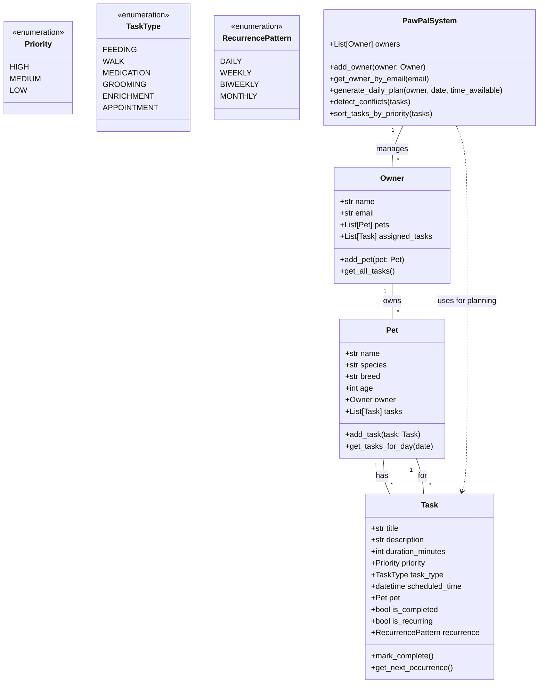

# PawPal+ System Design

## UML Class Diagram

## Key Design Decisions

1. **Owner-Pet-Task Relationship**: Owner has multiple Pets, each Pet has multiple Tasks
2. **Task Properties**: duration_minutes, priority, task_type, scheduled_time
3. **Recurring Tasks**: Support for daily, weekly, biweekly, monthly patterns
4. **Scheduling Algorithm**: Sort by priority, detect conflicts, fit within time constraints

## Core Classes to Implement

1. `Owner` - Pet owner with contact info and assigned tasks
2. `Pet` - Pet with species, breed, age and associated tasks  
3. `Task` - Individual care task with scheduling info
4. `PawPalSystem` - Main system for managing owners, pets, and generating plans
5. Enums: `Priority`, `TaskType`, `RecurrencePattern`
